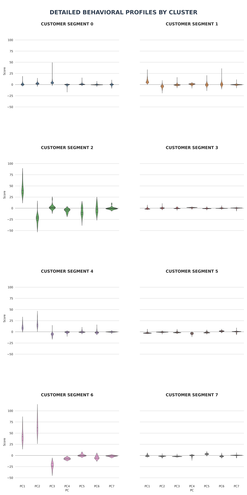
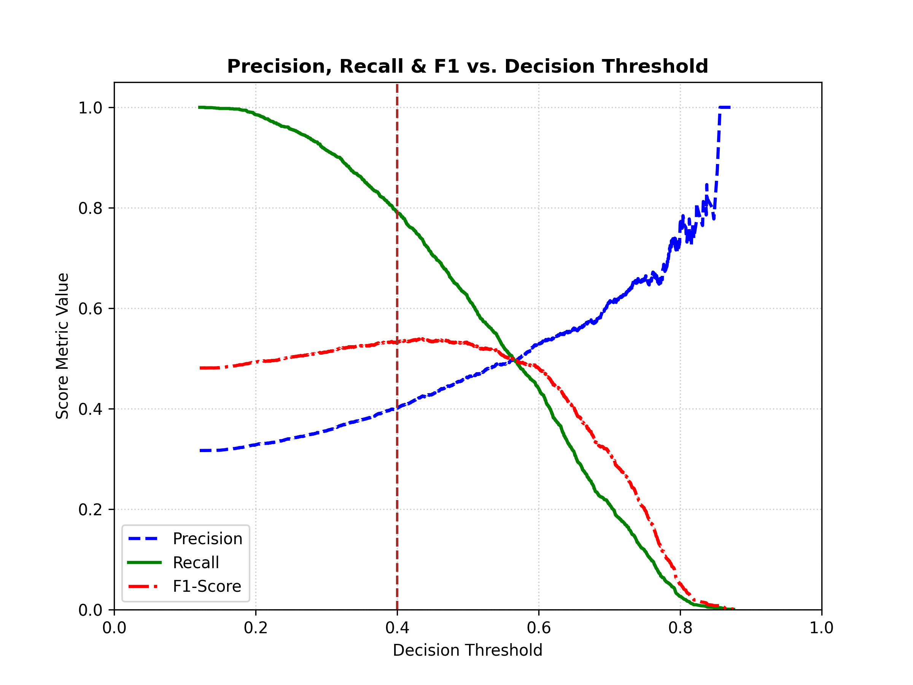

<h1>Data Science & Machine Learning Portfolio</h1>

I build data-driven models with a focus on <strong>feature engineering, interpretability, and decision-relevant insights</strong>.

This portfolio highlights selected projects across classification, time series, and unsupervised learning.

<h2>Projects</h2>

<h3>F1 Pit Stop Prediction</h3>

Predicting next-lap pit decisions using race telemetry data.

<ul>
    <li><strong>Focus:</strong> performance degradation and lap-time dynamics</li>
    <li><strong>Methods:</strong> RandomForest, feature engineering, robust scaling</li>
</ul>

<a href="f1-pit-stop-project/README.md">Project Overview</a> |
<a href="f1-pit-stop-project/f1_classification.html">Notebook (HTML)</a>

<h3>Credit Card Clustering</h3>

Segmenting credit card users based on financial behaviour using PCA and K-Means clustering.

<ul>
    <li><strong>Focus:</strong> spending pattern, credit usage and repayment behaviour.</li>
    <li><strong>Methods:</strong> Principal Component Analysis, K-Means Clustering, robust scaling, decomposition.</li>
</ul>

<a href="credit-card-clustering/ccc_project.html">Project Overview</a> |
<a href="credit-card-clustering/credit_card_clustering_project.html">Notebook (HTML)</a>

<h3>Ames Housing Price Prediction</h3>

Predicting house prices in Ames, Iowa using various house features.

<ul>
    <li><strong>Focus:</strong> feature engineering and error behaviour in high value houses.</li>
    <li><strong>Methods:</strong> Variance Inflation Factors, Linear Regression, robust scaling, Regularization.</li>
</ul>

<a href="housing-price-project/ames-webpage.html">Project Overview</a> |
<a href="housing-price-project/ames_housing_project.html">Notebook (HTML)</a>

<h3>Election Fraud Detection</h3>

Detecting fraudulent electoral activity using machine learning and adversarial election analytics.

<ul>
    <li><strong>Focus:</strong> fraud detection under class imbalance, multicollinearity, and noisy adversarial data</li>
    <li><strong>Methods:</strong> XGBoost, HistGradientBoosting, feature engineering, threshold tuning</li>
</ul>

<a href="electoral-fraud-detection/webpage.html">Project Overview</a> |
<a href="electoral-fraud-project/electoral_fraud_project.html">Notebook (HTML)</a>

<h2>Upcoming Work</h2>

<ul>
    <li>Retail Demand Forecasting (Time Series)</li>
</ul>

<h2>Stack</h2>

Python · Pandas · Scikit-Learn · Matplotlib · Numpy · Seaborn

