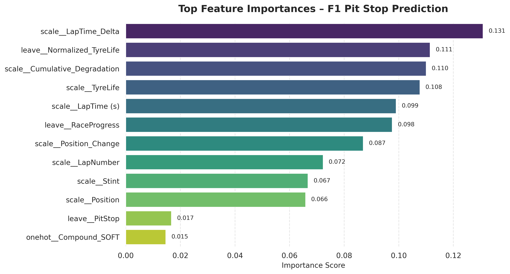

# F1 Pit Stop Prediction  

Predicting next-lap pit stop decisions in Formula 1 using machine learning.

<a href="f1_claasification.html"> View Notebook</a> • 
<a href="#key-insight"> Key Insight</a> • 
<a href="#approach"> Approach</a>

---

## Overview

This project uses machine learning to predict whether a driver will make a pit stop on the next lap in Formula 1 race data.

The model learns from race telemetry such as tyre wear, lap performance, and race context to identify patterns behind strategic pit decisions.

---

## Feature Importance

  

---

## Key Insight

Pit stop decisions are primarily driven by **performance degradation over time**, particularly changes in lap time and tyre wear progression.

Rather than relying on static features like tyre compound, the model captures how race performance evolves—reflecting real-world strategy dynamics.

---

## Approach

- Data cleaning and preprocessing  
- Exploratory data analysis  
- Feature engineering  
- Classification modeling  

---

##  Tools

`Python` • `Pandas` • `Seaborn` • `Scikit-learn`

---

## Future Improvements

- SHAP for feature interpretability  
- Hyperparameter tuning  
- Time-aware sequential modeling  

---
