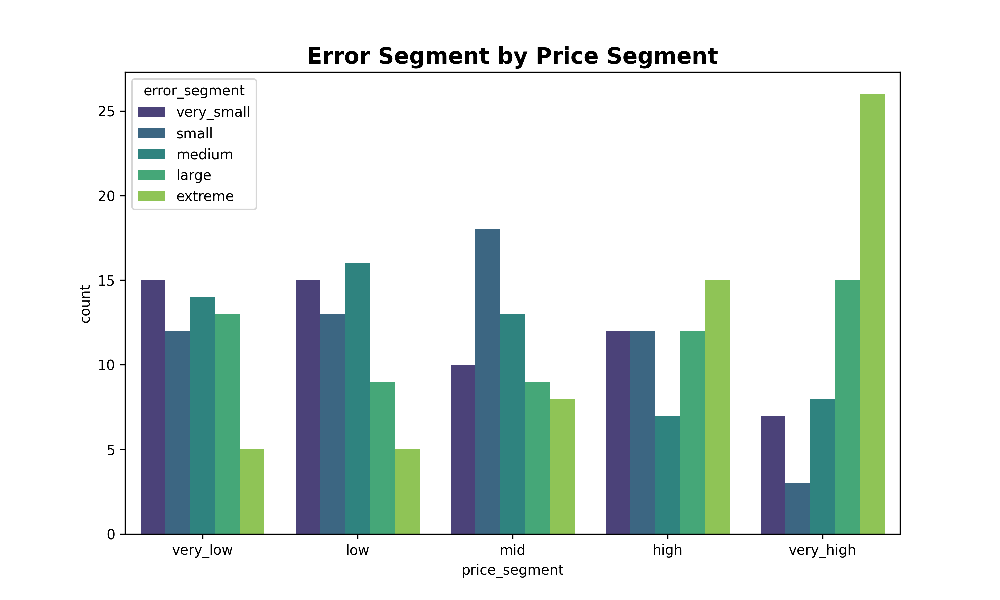

<h1>Ames Housing Price Prediction</h1>

End-to-end regression pipeline for predicting house prices using feature engineering, regularized linear models, and error analysis.

<a href="ames_housing_project.html">View Notebook</a> •
<a href="#key-insight">Key Insight</a> •
<a href="#approach">Approach</a>

<h2>Overview</h2>

This project builds a supervised machine learning pipeline to predict housing prices using the Ames Housing dataset. The dataset contains a high-dimensional mix of numerical, ordinal, and categorical features describing residential properties.

The objective is to construct a robust regression model capable of generalizing across heterogeneous housing characteristics while handling multicollinearity, skewed distributions, and nonlinear feature interactions.

---

<h2 align="center">Model Performance</h2>

---

<h2 id="key-insight">Key Insight</h2>

House prices are primarily driven by structural quality, living area, and neighborhood effects, but the relationship becomes increasingly nonlinear in the upper price range.

Linear regularized models perform well on the central distribution of the dataset but show systematic under-prediction for high-value properties, indicating a distinct behavior regime for luxury housing.

---

<h2 id="approach">Approach</h2>

<ul>
<li>Data cleaning and missing value handling</li>
<li>Ordinal encoding for hierarchical categorical variables</li>
<li>One-hot encoding for nominal features</li>
<li>Feature engineering (age-based variables, binary indicators, and aggregated features)</li>
<li>Log transformations for skewed numerical variables</li>
<li>Multicollinearity reduction through feature pruning and derived variables</li>
<li>Model training (Linear Regression, Ridge, Lasso, ElasticNet, Random Forest, Gradient Boosting)</li>
<li>Residual diagnostics and error segmentation</li>
</ul>

---

<h2>Model Results</h2>

<ul>
<li>Linear Regression: baseline model with moderate bias</li>
<li>Ridge Regression: improved stability with similar predictive performance</li>
<li>Lasso Regression: feature sparsity with no major performance gain</li>
<li>ElasticNet: best-performing linear model with balanced regularization</li>
<li>Random Forest: strong training performance but severe overfitting</li>
<li>Gradient Boosting: high variance and unstable generalization</li>
</ul>

ElasticNet was selected as the final model due to the best trade-off between bias, variance, and generalization stability.

---

<h2>Tools</h2>

Python • Pandas • NumPy • Scikit-learn • Matplotlib • Seaborn

---

<h2>Future Improvements</h2>

<ul>
<li>Interaction feature engineering (e.g., quality × area effects)</li>
<li>Stronger regularization for boosting models</li>
<li>Quantile regression for better tail performance</li>
<li>Deployment as an interactive prediction system</li>
</ul>
